# 🍽️ RecipeBox


> **"Built to demonstrate modern Android development practices through a complete recipe discovery experience."**

RecipeBox is a modern Android application that helps users discover, search, and save delicious recipes with a clean interface and smooth user experience.

The project demonstrates modern Android development practices using **Kotlin**, **Room Database**, **Retrofit**, **Coroutines**, **Glide**, and **Material Design**.

---

# ⭐ Highlights

* Modern Android Architecture
* Real REST API Integration
* Offline Persistence
* Production-style Error Handling
* Smooth UI Animations
* Material Design Components

---

# ✨ Features

* 🔍 Search Recipes
* 🥕 Search by Ingredients
* ❤️ Save Favorite Recipes
* 📖 View Recipe Details
* 🌱 Browse Recommended, Healthy, Vegan, Popular, and Quick Recipes
* 💾 Offline Support with Room Database
* ⚡ Fast & Responsive UI
* 🛡️ Comprehensive Error Handling

---

# 📸 Application Overview

The application is designed to make recipe discovery simple and enjoyable. Users can browse multiple categories, search by recipe name or ingredients, save favorites for offline access, and view detailed cooking instructions through a modern and responsive interface.

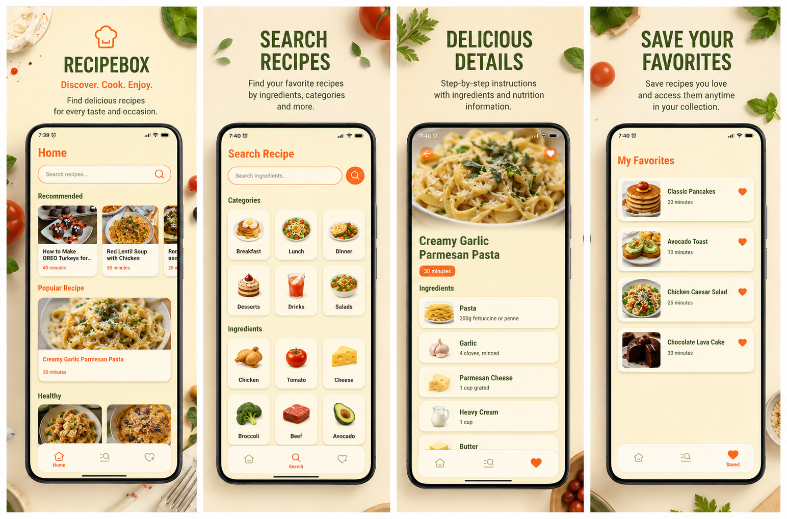

---

# 🏠 Home Screen

The Home screen serves as the application's main dashboard. Recipes are loaded dynamically from the Spoonacular API and organized into multiple categories.

### Features Demonstrated

* Recommended Recipes
* Popular Recipes
* Healthy Recipes
* Quick Recipes
* Vegan Recipes
* Retrofit API Integration
* Horizontal RecyclerViews
* Glide Image Loading
* Loading States
* Network Error Handling
* HTTP Error Handling
* Fade Animations

### Home Screen

The top section displays featured recipe categories while maintaining a clean and responsive interface.

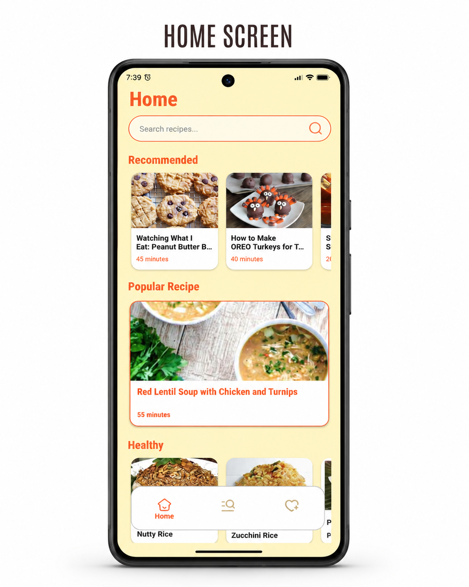

---

### Home Screen (Bottom)

The lower section continues with additional categories, providing users with a smooth scrolling experience.

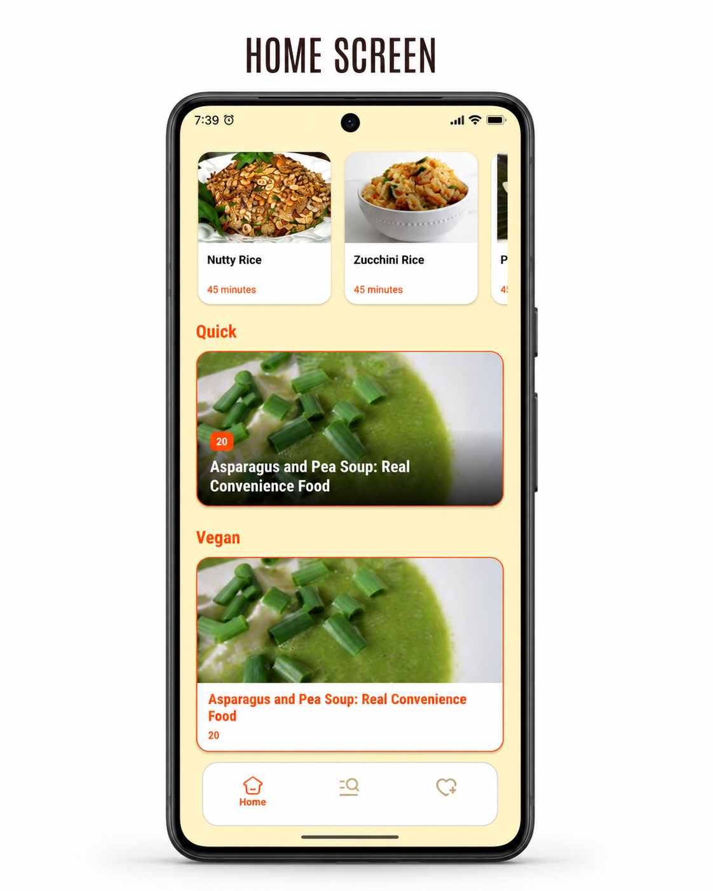

---

# 🔍 Search Recipes

Users can search recipes by entering the recipe name.

### Features Demonstrated

* Recipe Search
* Input Validation
* Empty Query Validation
* Search Results
* Empty Result Handling
* Loading Indicator
* Network Error Handling
* HTTP Error Handling
* RecyclerView
* Fade Animation

### Search Screen

The application validates user input before sending requests to the API.

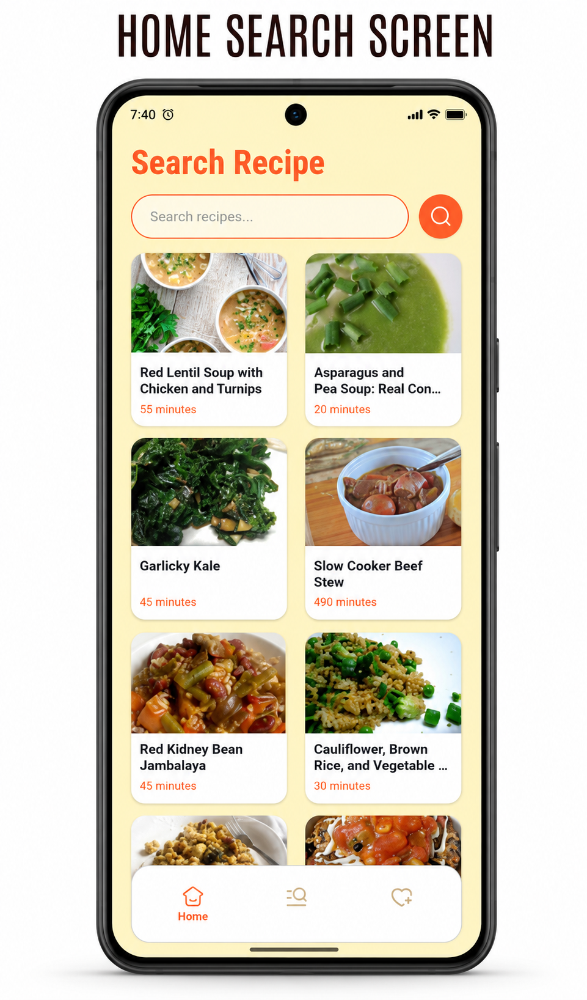

---

### Search Results

Matching recipes are displayed after a successful search request.

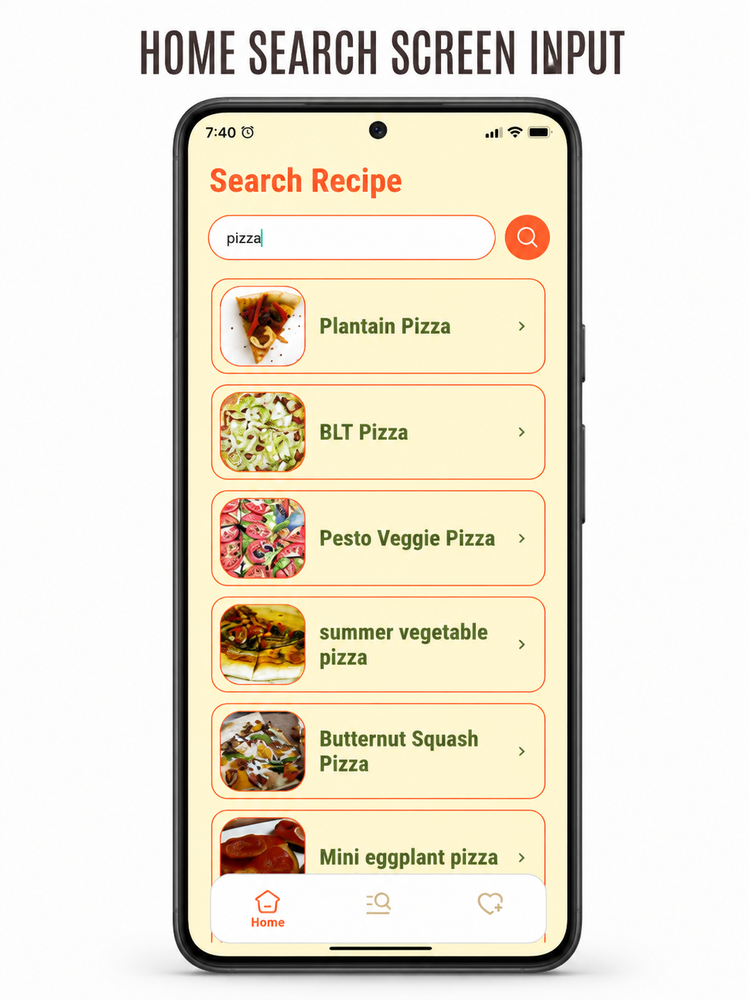

---

# 🥕 Search by Ingredients

RecipeBox also allows users to discover recipes using ingredients already available in their kitchen.

### Features Demonstrated

* Ingredient Categories
* Multiple Ingredient Selection
* Search by Ingredients
* Loading State
* Empty State
* Placeholder Images
* Network Error Handling
* HTTP Error Handling
* RecyclerView

### Ingredient Categories

Users can browse ingredients grouped into categories such as vegetables, fruits, dairy products, proteins, and grains.

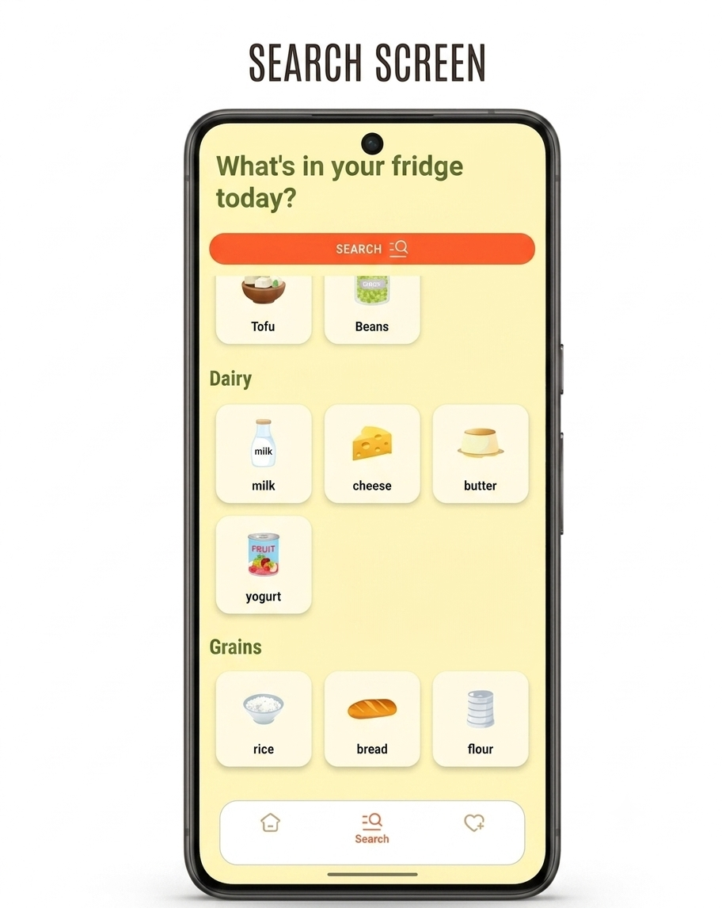

---

### Recipes by Ingredients

After selecting multiple ingredients, matching recipes are retrieved from the Spoonacular API and displayed in a dedicated results screen.

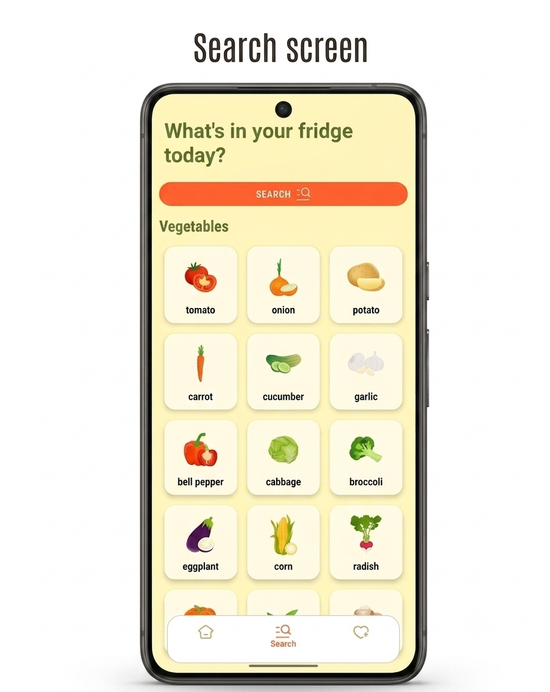

---

# 📖 Recipe Details

The details page provides complete information about the selected recipe.

### Features Demonstrated

* Recipe Image
* Cooking Time
* Servings
* Ingredients List
* Cooking Instructions
* Save Recipe
* Remove Saved Recipe
* Glide Image Loading
* Room Database Integration

### Recipe Details Screen

Users can view complete cooking information and save recipes for offline access.

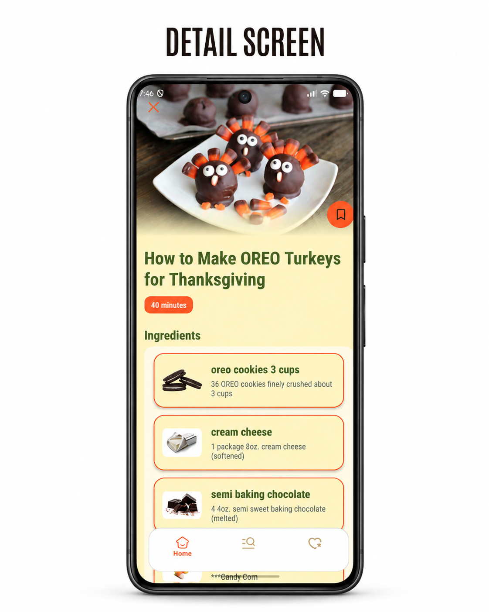

---

# ❤️ Saved Recipes

Favorite recipes are stored locally using Room Database and remain accessible even without an internet connection.

### Features Demonstrated

* Room Database
* Offline Storage
* Delete Saved Recipes
* Empty State
* RecyclerView
* Fade Animation

### Saved Recipes Screen

Users can browse and manage their locally stored favorite recipes.

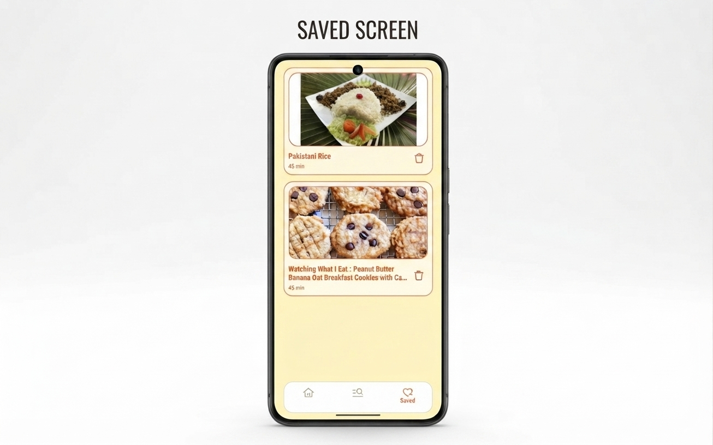

---

# 🛠️ Tech Stack

| Technology      | Description              |
| --------------- | ------------------------ |
| Kotlin          | Programming Language     |
| MVVM            | Architecture Pattern     |
| Retrofit        | REST API Client          |
| Room Database   | Local Persistence        |
| Coroutines      | Asynchronous Programming |
| RecyclerView    | Dynamic Lists            |
| Glide           | Image Loading            |
| Material Design | UI Components            |
| ViewBinding     | View Binding             |
| Spoonacular API | Recipe Data              |

---

# 🛡️ Error Handling

RecipeBox includes production-style error handling to ensure a smooth user experience.

### Input Validation

* Empty Search
* Too Short Query
* Too Long Query
* Emoji Filtering
* Number Filtering
* Multiple Spaces Validation

### Network Handling

* No Internet Connection
* Loading State
* HTTP 401
* HTTP 402
* HTTP 429
* HTTP 500
* Unknown Server Errors

### UI States

* Empty Search Results
* Empty Saved Recipes
* Placeholder Images
* Smooth Screen Transitions

### Error & Loading Example

The application gracefully handles real-world scenarios such as network failures, invalid requests, API limitations, and empty responses.

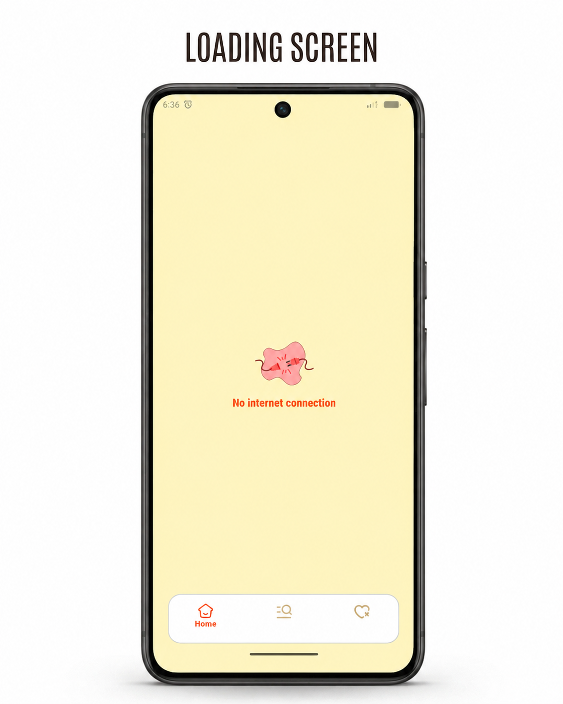

---

# 🏗️ Architecture

The project follows a clean separation of concerns using MVVM architecture.

```text
Presentation
│
├── Fragments
├── RecyclerView Adapters
└── ViewBinding

↓

Data

├── Retrofit
├── Spoonacular API
└── Room Database

↓

Storage

└── Room Database
```

---

# 📷 Additional Screenshots

### Greeting Screen

The welcome screen displayed when launching the application.

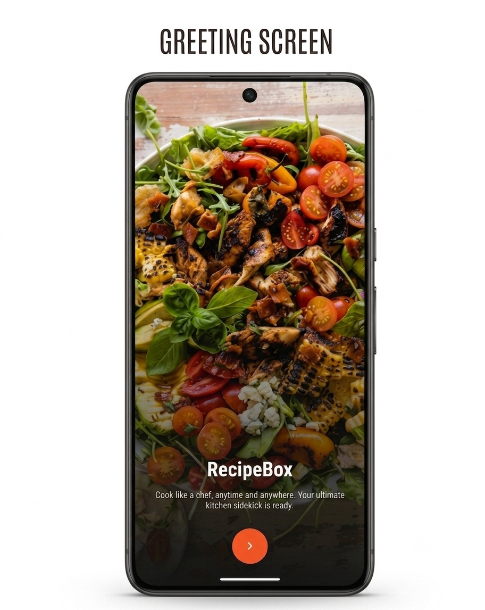

---

### Navigation Menu

The application's side navigation menu.

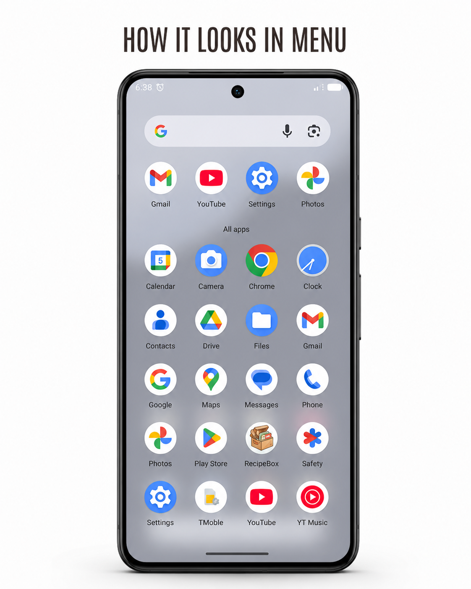

---

### Menu (Expanded)

Additional menu options and navigation.


---

# 🚀 Installation

Clone the repository

```bash
git clone https://github.com/SamMobileDev/RecipeBox.git
```

Open the project in Android Studio.

Replace the existing Spoonacular API key with your own.

Build and run the application.

---

# 🔑 API

RecipeBox uses the **Spoonacular REST API** for retrieving recipe information.

Generate your own API key and replace the existing key before running the project.

---

# 📈 Future Improvements

* 🌙 Dark Theme
* 📄 Pagination
* 🎯 Advanced Recipe Filters
* 🕒 Search History
* ☁️ Cloud Synchronization
* 💉 Dependency Injection (Hilt)
* 🧩 Repository Layer
* 🧪 Unit Testing
* 🤖 UI Testing
* 🎨 Jetpack Compose Migration

---

# 👨‍💻 Developer

**SAM Android Dev**

Android Developer passionate about building modern, clean, and production-ready Android applications using Kotlin and modern Android technologies.

---

⭐ **If you enjoyed this project, consider giving it a star!**

